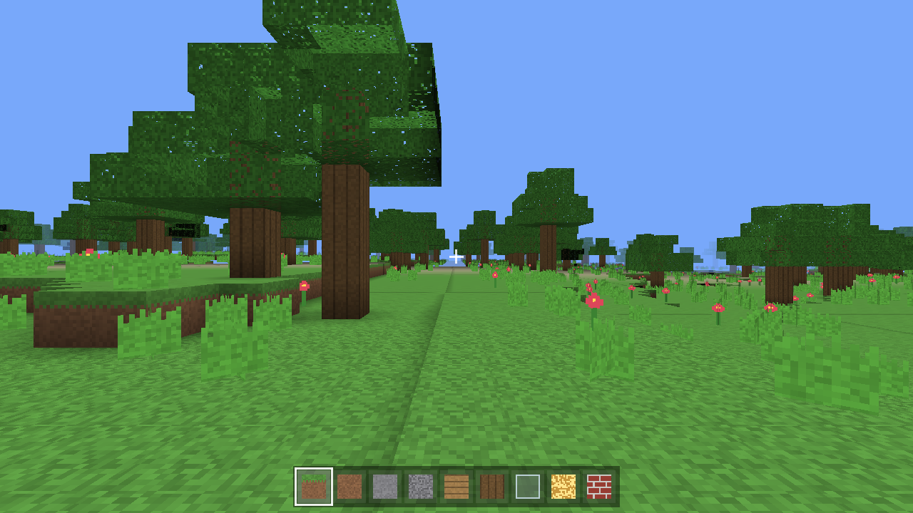

# MiniCraft

A Minecraft-style voxel game written from scratch in modern C++17 with OpenGL.
It builds a procedurally generated, infinite, block world you can explore, mine,
and build in — with biomes, caves, trees, day/night lighting, water, physics,
and a survival mode. **No external game assets are required**: every texture is
generated procedurally at startup, so the project is fully self-contained and
has no dependency on copyrighted Minecraft resources.



## Features

**World & generation**
- Infinite procedural terrain from layered Perlin noise (fractal Brownian motion).
- Biomes: ocean, beach, plains, forest, desert, mountains, snowy — each with its
  own surface blocks, height profile, and vegetation.
- 3D-noise carved caves, depth-dependent ore distribution (coal / iron / gold /
  diamond), gravel pockets, lakes/oceans up to sea level.
- Trees (forest & plains), cacti (desert), flowers and tall grass.
- 16×16×128 chunks streamed in/out around the player.

**Rendering**
- OpenGL 3.3+ core profile, modern VAO/VBO pipeline.
- Procedural 256×256 texture atlas with mipmaps (27 block textures).
- Per-vertex **ambient occlusion** and smooth **flood-filled lighting**:
  sky-light (top-down + horizontal spread) and block-light from emissive blocks
  (glowstone, torches), exactly like Minecraft's two-channel light model.
- Directional sun with a full **day/night cycle**, distance **fog**, and
  per-face shading for solid 3D readability.
- Separate, depth-sorted **transparent pass** for water, glass, leaves and plants.
- **Frustum culling** of chunks; greedy per-face culling in the mesher.
- Multithreaded chunk generation & meshing (worker pool) so exploring never
  stalls the render thread; GPU uploads are budgeted per frame.

**Gameplay**
- AABB collision, gravity, jumping, sprinting, swimming, water buoyancy & drag.
- Voxel raycasting (Amanatides–Woo) for precise block selection.
- Break & place blocks; survival breaking speed scales with block hardness;
  bedrock/water are unbreakable; placement is blocked inside the player.
- 9-slot hotbar with item icons (scroll wheel or number keys to select).
- Health & hunger with fall / cactus / suffocation / starvation damage, natural
  regen, death + respawn.
- Game modes: **Survival**, **Creative** (flight via double-tap space, instant
  break), **Spectator** (noclip flight).
- First- and third-person camera (F5).
- World save/load (RLE-compressed binary) with periodic autosave.
- Built-in PNG screenshots (F2).

## Controls

| Input | Action |
|-------|--------|
| `W` `A` `S` `D` | Move |
| Mouse | Look |
| `Space` | Jump / swim up / fly up |
| `Left Shift` | Sneak / fly down |
| `Left Ctrl` | Sprint |
| Double-tap `Space` | Toggle flight (Creative) |
| Left mouse | Break block |
| Right mouse | Place block |
| Scroll / `1`–`9` | Select hotbar slot |
| `G` | Cycle game mode |
| `F3` | Debug info (in window title) |
| `F5` | Toggle first/third person |
| `F2` | Save screenshot |
| `F11` | Toggle fullscreen |
| `R` | Respawn (when dead) |
| `Esc` | Pause / release cursor |

## Building

Dependencies: a C++17 compiler, CMake ≥ 3.16, GLFW3, GLEW, GLM, OpenGL.

On Debian/Ubuntu:
```bash
sudo apt-get install -y build-essential cmake \
    libglfw3-dev libglew-dev libglm-dev libgl1-mesa-dev
```

Then:
```bash
cmake -S . -B build -DCMAKE_BUILD_TYPE=Release
cmake --build build -j
./build/minicraft            # default 1280x720
./build/minicraft 1920 1080  # custom resolution
```

The executable finds `assets/shaders/` relative to the source tree
(via a compiled-in path) or via `./assets`.

### Windows

**Prebuilt:** download `MiniCraft-Windows-x64.zip`, extract it, and run
`minicraft.exe` (keep the `assets` folder beside it). No installation or extra
DLLs are required on Windows 10/11 x64.

**Build with MSVC + vcpkg:**
```bat
vcpkg install glfw3 glew glm
cmake -S . -B build -DCMAKE_TOOLCHAIN_FILE=<vcpkg>/scripts/buildsystems/vcpkg.cmake
cmake --build build --config Release
```

**Cross-compile from Linux (MinGW-w64):** produces the self-contained zip with a
statically linked GLFW + GLEW (no bundled DLLs):
```bash
sudo apt-get install -y g++-mingw-w64-x86-64 mingw-w64-tools libglm-dev curl unzip zip
scripts/build-windows.sh        # -> MiniCraft-Windows-x64.zip
```

## Architecture

```
src/
  Core/      Window (GLFW/GLEW), Logger, ThreadPool, PNG screenshot writer
  Math/      Perlin/fBm noise
  Render/    Shader, Camera + frustum, procedural TextureAtlas, tile ids
  World/     Block registry, Chunk (+ lighting), ChunkMesher (AO/light/culling),
             TerrainGenerator (biomes/caves/ores/trees), World (streaming/save)
  Player/    Player physics, collision, stats, game modes; Input snapshot
  UI/        HUD (crosshair, hotbar, health/hunger)
  Game.*     Main loop (fixed-timestep physics), input, day/night, interaction
  main.cpp
assets/shaders/   chunk.vert/frag, line.vert/frag
```

The game loop runs physics and world updates on a fixed 60 Hz timestep while
rendering as fast as vsync allows. Chunk voxel generation and meshing run on
background threads; only GPU buffer uploads happen on the main thread.

## Notes

Textures are generated in code (`Render/TextureAtlas.cpp`) rather than loaded
from the Minecraft client, both to keep the project legally redistributable and
to make it build & run with zero asset downloads. The loader code path for
external assets (`readAssetFile`) is in place if you wish to add your own.
