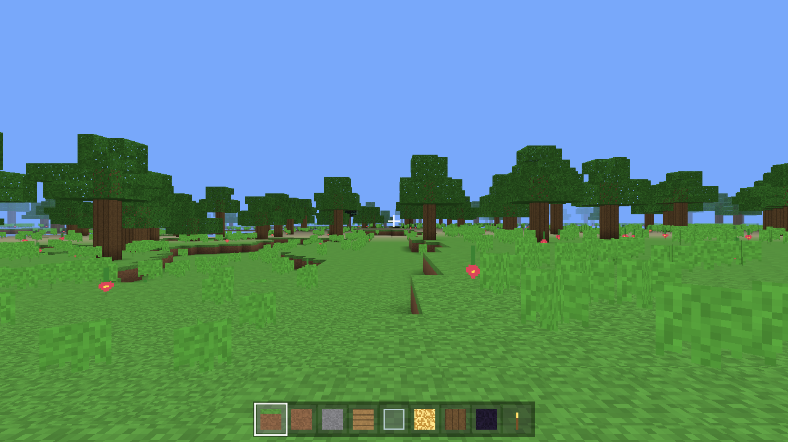
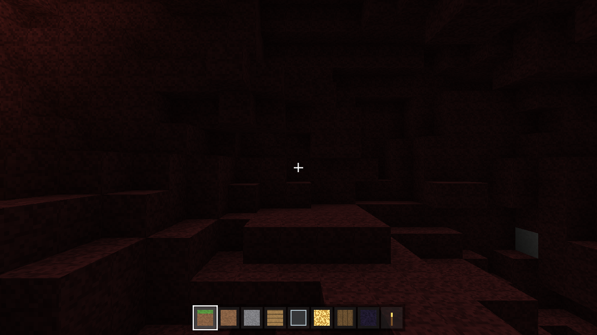
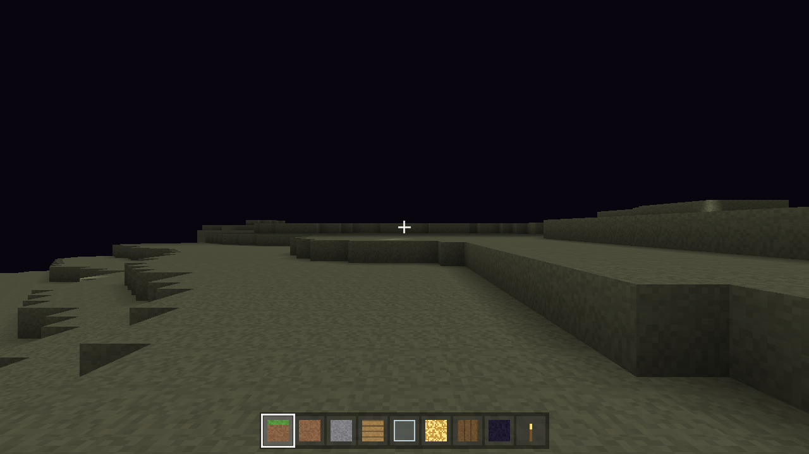

# MiniCraft (Java / LWJGL)

A Minecraft-style voxel game written from scratch in Java with **LWJGL 3** (the
same OpenGL/GLFW binding the real Minecraft uses) and **JOML** for math. It has
all three dimensions — **Overworld, Nether, and End** — with portal travel
between them.

| Overworld | Nether | End |
|-----------|--------|-----|
|  |  |  |

## Textures

By default every texture is **generated procedurally** at startup, so the game
runs with no external assets.

It can optionally use the **real Minecraft block textures from your own local,
legally-owned copy** of the game — they are read directly from your installed
`.minecraft` and never downloaded or redistributed. If a copy isn't found, the
procedural textures are used.

- The game auto-detects `.minecraft/versions/<version>/<version>.jar` on
  Windows (`%APPDATA%`), macOS (`~/Library/Application Support`), and Linux
  (`~/.minecraft`).
- Or point it explicitly:
  ```bash
  MINICRAFT_MC_JAR=/path/to/1.20.1.jar ./run.sh
  ```

## Dimensions

- **Overworld** — biomes, caves, ores, trees, water, day/night cycle.
- **Nether** — netherrack caverns, lava seas, glowstone, soul sand, quartz,
  magma, red ambient glow, bedrock roof.
- **End** — floating end-stone islands in the void under a dark sky.

**Travel:**
- Build an **obsidian frame** (interior up to ~3×4), look at it and press **F**
  to light a **nether portal**; stand in it to travel (Overworld ↔ Nether with
  1:8 coordinate scaling, with a portal built at the destination).
- Quick dimension keys are also available: **O** Overworld, **N** Nether,
  **M** the End.

## Controls

`WASD` move · mouse look · `Space` jump/fly up · `Shift` sneak/fly down ·
`Ctrl` sprint · double-tap `Space` toggle flight (Creative) · left/right mouse
break/place · wheel or `1`–`9` select hotbar · `G` game mode · `F` light nether
portal · `O`/`N`/`M` go to Overworld/Nether/End · `F5` first/third person ·
`F3` debug · `F2` screenshot · `F11` fullscreen · `R` respawn · `Esc` pause.

The dimension, FPS, position and mode are shown in the window title bar.

## Build & run

Requires JDK 17+ and Maven. LWJGL natives for Windows, Linux and macOS
(x64 + Apple Silicon) are bundled into one runnable jar, so the same jar runs
on every desktop OS.

```bash
mvn package
./run.sh           # Linux / macOS  (adds -XstartOnFirstThread on macOS)
run.bat            # Windows
# or directly:
java -jar target/minicraft.jar
```

> macOS note: LWJGL requires `-XstartOnFirstThread` (handled by `run.sh`).

## Architecture

```
com.minicraft
  core/      Window (GLFW/LWJGL)
  math/      Perlin/fBm noise
  render/    Shader, Camera+frustum, procedural TextureAtlas, tile ids
  assets/    AssetLoader (optional real textures from the user's own copy)
  world/     Blocks, Chunk(+lighting), ChunkMesher (AO/light/culling),
             TerrainGenerator (per-dimension), World (streaming/save), Dimension
  player/    Player physics/stats/modes, InputState
  ui/        HUD
  Game       main loop, input, dimensions/portals, day-night, save/load
  Main
resources/shaders/   chunk + line GLSL
```

Physics and world updates run on a fixed 60 Hz timestep; chunk generation and
meshing run on a worker thread pool, with GPU uploads on the main thread.
