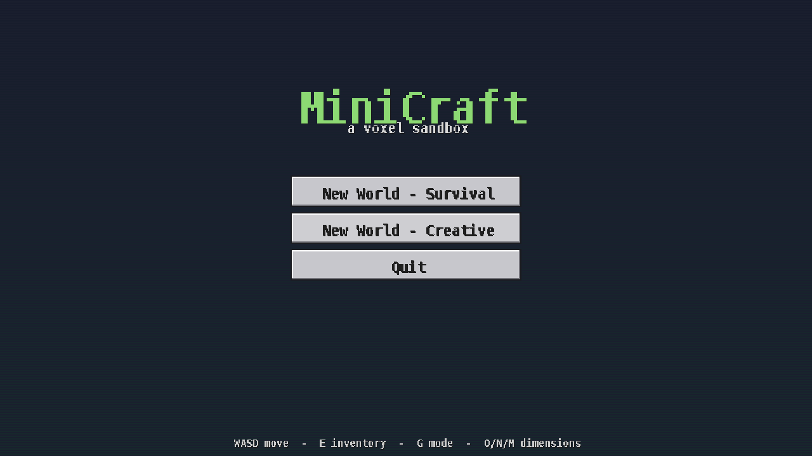
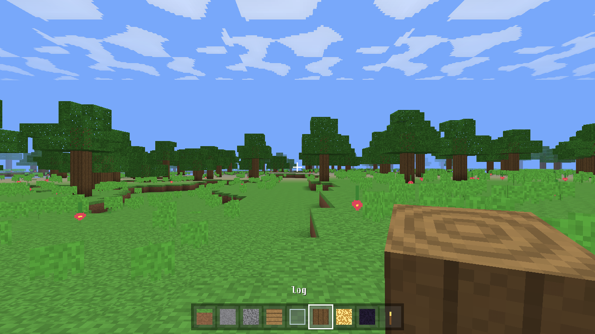
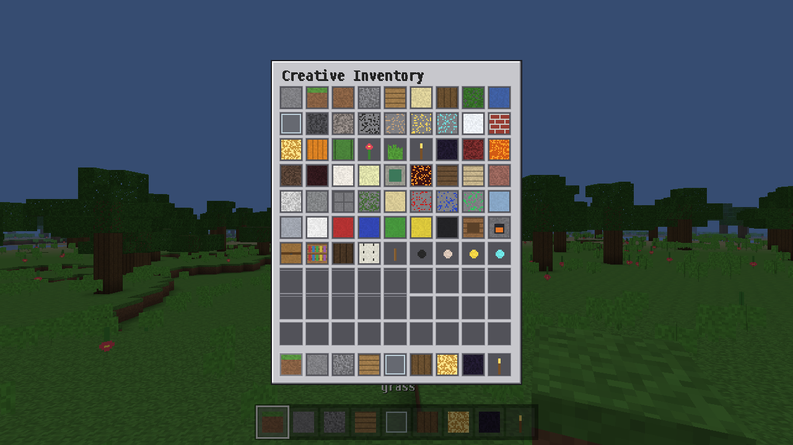
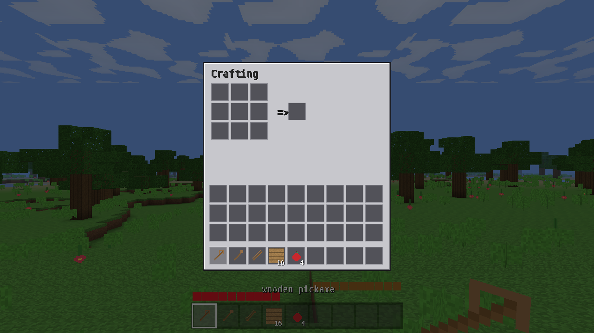
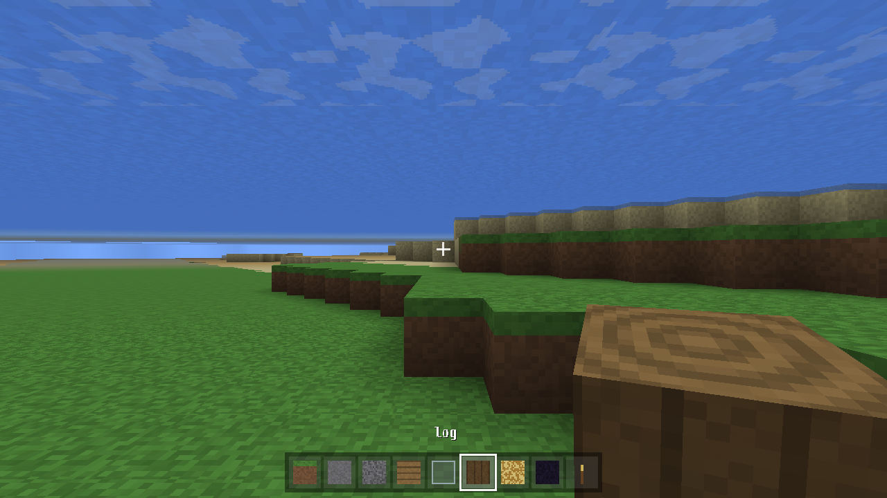
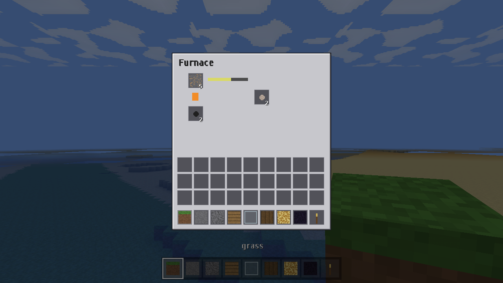
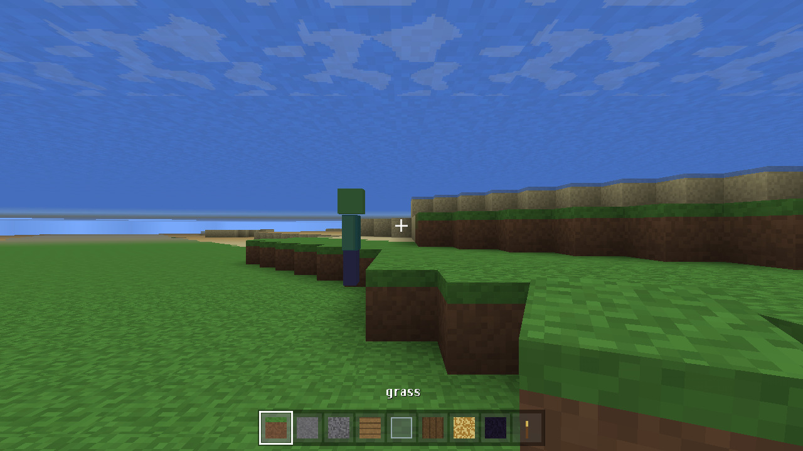
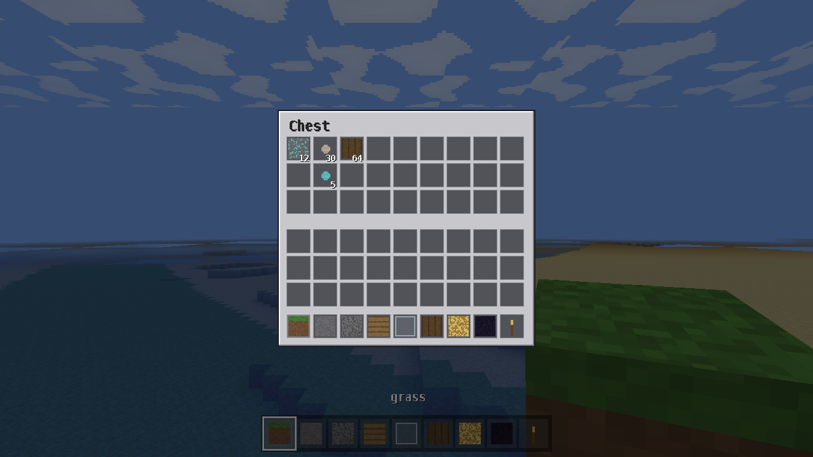

# MiniCraft (Java / LWJGL)

A Minecraft-style voxel game written from scratch in Java with **LWJGL 3** (the
same OpenGL/GLFW binding the real Minecraft uses) and **JOML** for math. It has
all three dimensions — **Overworld, Nether, and End** — with portal travel,
a main menu, a full inventory with crafting, a survival mode, clouds and an
animated first-person hand.

| Main menu | World + clouds + hand | Creative inventory | Survival crafting |
|-----------|-----------------------|--------------------|-------------------|
|  |  |  |  |

| Varied terrain (hills, water, biomes) | Furnace smelting |
|---------------------------------------|------------------|
|  |  |

| Overworld | Nether | End |
|-----------|--------|-----|
|  |  |  |

## Newest update

- **Mobs**: passive **sheep** that wander and drop wool, and hostile **zombies**
  that chase and attack at night. Melee them with left-click (swords/axes hit
  harder); they have health, knockback and simple AABB-physics AI.
- **Chests**: place a chest and right-click to open 27 slots of storage; contents
  are saved with the world (and spill out if you break it).
- **Furnaces persist**: furnace contents and smelting state are now saved too.
- **Procedural sound**: footsteps, digging, block break/place, jump and hurt
  cues are **synthesised in code** at runtime via OpenAL (no audio files are
  used, so nothing is copied from Minecraft). Material-aware (stone/wood/dirt/
  sand/glass/wool). Silently disabled when no audio device is present.
- **Textures closer to vanilla**: muted palette, cobblestone with mortar,
  speckled dirt/gravel, varied grass blades, sparse stone flecks.
- **Generation closer to vanilla**: ores now form small **veins** instead of
  single dots (on top of the earlier hills/mountains/rivers/biomes rework).

| Mobs (sheep & zombies) | Chest storage |
|------------------------|---------------|
|  |  |

## Latest update

- **Furnace smelting**: right-click a furnace to open it. Input + fuel → output,
  with a flame gauge and smelt-progress arrow; furnaces keep smelting in the
  background. Recipes: iron/gold ore → ingots, sand → glass, cobblestone →
  stone, logs → charcoal, clay → brick. Fuels: coal, planks, logs, sticks.
  (Iron & gold ore now drop the ore block, so they must be smelted.)
- **Reworked world generation**: rolling hills and real elevation instead of a
  flat plain, sharp **mountain ranges**, winding **rivers** carved down to water,
  oceans/beaches, and more distinct **biomes** (plains, forest, taiga with
  spruce, snowy, desert, mountains). **Fewer trees**, with oak/birch/spruce
  chosen per biome, plus more ore types (redstone, lapis, emerald).
- **Darker textures** tuned closer to vanilla Minecraft's muted palette.

## What's new

- **Main menu** with New World (Survival/Creative), Continue, Quit; in-game
  pause menu (Resume / Save & Quit to Title). Text is rendered with a bitmap
  font baked at startup.
- **Inventory & crafting** (Minecraft-style): 9-hotbar + 27-storage, a 3×3
  crafting grid with shaped & shapeless recipes (planks, sticks, crafting
  table, chest, furnace, torches, stone bricks, full tool sets, …), drag-and-
  drop with a cursor stack, and a creative item palette of every block/item.
- **Survival mode**: blocks drop items when mined, placing consumes the stack,
  health & hunger with fall/lava/cactus/starvation damage, a starter kit and a
  death/respawn flow.
- **Sky with clouds**: a scrolling blocky cloud layer over the Overworld.
- **Animated first-person hand** that holds the selected block/item, swings on
  use and bobs while walking.
- **20+ extra blocks**: spruce/birch wood, granite/diorite/andesite, stone
  bricks, mossy cobble, sandstone, redstone/lapis/emerald ore, wool colours,
  ice, clay, crafting table, furnace, chest, bookshelf — plus new items
  (sticks, ingots, gems, tools, apple). Procedural textures were refined to
  look closer to vanilla.

## Textures

By default every texture is **generated procedurally** at startup, so the game
runs with no external assets.

It can optionally use the **real Minecraft block textures from your own local,
legally-owned copy** of the game — they are read directly from your installed
`.minecraft` and never downloaded or redistributed. If a copy isn't found, the
procedural textures are used.

- The game auto-detects `.minecraft/versions/<version>/<version>.jar` on
  Windows (`%APPDATA%`), macOS (`~/Library/Application Support`), and Linux
  (`~/.minecraft`).
- Or point it explicitly:
  ```bash
  MINICRAFT_MC_JAR=/path/to/1.20.1.jar ./run.sh
  ```

## Dimensions

- **Overworld** — biomes, caves, ores, trees, water, day/night cycle.
- **Nether** — netherrack caverns, lava seas, glowstone, soul sand, quartz,
  magma, red ambient glow, bedrock roof.
- **End** — floating end-stone islands in the void under a dark sky.

**Travel:**
- Build an **obsidian frame** (interior up to ~3×4), look at it and press **F**
  to light a **nether portal**; stand in it to travel (Overworld ↔ Nether with
  1:8 coordinate scaling, with a portal built at the destination).
- Quick dimension keys are also available: **O** Overworld, **N** Nether,
  **M** the End.

## Controls

`WASD` move · mouse look · `Space` jump/fly up · `Shift` sneak/fly down ·
`Ctrl` sprint · double-tap `Space` toggle flight (Creative) · left/right mouse
break/place · wheel or `1`–`9` select hotbar · `E` inventory · `G` game mode ·
`F` light nether portal (look at an obsidian frame) · `O`/`N`/`M` go to
Overworld/Nether/End · `F5` first/third person · `F3` debug · `F2` screenshot ·
`F11` fullscreen · `R` respawn · `Esc` pause/menu.

Right-click a **crafting table** for the crafting grid, a **furnace** to smelt,
or a **chest** for storage. Left-click a mob to attack it. In creative, the
inventory is an item palette — click an item to grab it, then drop it on the
hotbar.

The dimension, FPS, position and mode are shown in the window title bar.

## Build & run

Requires JDK 17+ and Maven. LWJGL natives for Windows, Linux and macOS
(x64 + Apple Silicon) are bundled into one runnable jar, so the same jar runs
on every desktop OS.

```bash
mvn package
./run.sh           # Linux / macOS  (adds -XstartOnFirstThread on macOS)
run.bat            # Windows
# or directly:
java -jar target/minicraft.jar
```

> macOS note: LWJGL requires `-XstartOnFirstThread` (handled by `run.sh`).

## Architecture

```
com.minicraft
  core/      Window (GLFW/LWJGL)
  math/      Perlin/fBm noise
  render/    Shader, Camera+frustum, procedural TextureAtlas, tile ids
  assets/    AssetLoader (optional real textures from the user's own copy)
  world/     Blocks, Chunk(+lighting), ChunkMesher (AO/light/culling),
             TerrainGenerator (per-dimension), World (streaming/save), Dimension
  player/    Player physics/stats/modes, InputState
  ui/        HUD
  Game       main loop, input, dimensions/portals, day-night, save/load
  Main
resources/shaders/   chunk + line GLSL
```

Physics and world updates run on a fixed 60 Hz timestep; chunk generation and
meshing run on a worker thread pool, with GPU uploads on the main thread.
